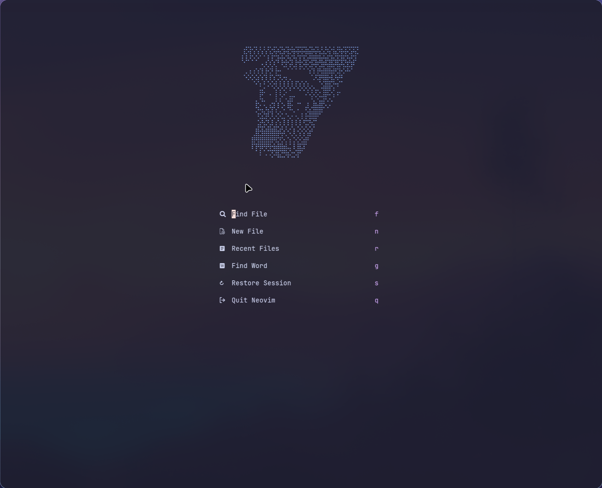
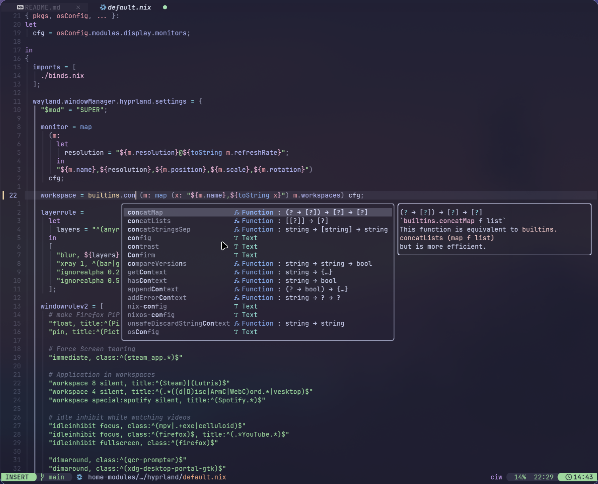

<h1 align="center">
      
      <br>

Akari


   <br>
  <div align="center">

  <div align="center">
   <p></p>
   <a href="https://github.com/sioodmy/dotfiles/">
      
   </a>
      <a = href="https://nixos.org">
      
    </a>
   <br>
</div>
</h1>
<p align=center>Standalone nixvim flake based on Lazyvim with some more changes.</p>

---

<br>
</div>




<p align="center"> Screenshots Circa: 2024-4-9</p>

---


# 🔨 Installation

If you'd like to give it a try before installing: `nix run github:spector700/Akari`

### Adding it as a flake

1: Go to the flake.nix and add `Akari.url = "github:spector700/Akari"` to your inputs.

```nix
# flake
{
  inputs = {
    nixpkgs.url = "github:nixos/nixpkgs/nixos-unstable";

    Akari.url = "github:spector700/Akari";
  };
}
```
2: Run nix flake update

3: Install it by adding `inputs.Akari.packages.${system}.default` to your environment.systemPackages or home.packages. If you're using home-manager.

```nix
# packages
{ inputs, pkgs, ... }:
{
  home.packages = with pkgs; [
    inputs.Akari.packages.${system}.default
  ];
}
```

4: Rebuild your system.

</details>

# ⚙️ Configuration

To start configuring, add or modify the nix files in `./config`.
If you add a new configuration file, remember to add it to the
[`config/default.nix`](./config/default.nix) file

## Testing your new configuration

To test your configuration simply run the following command

```
nix run .
```
